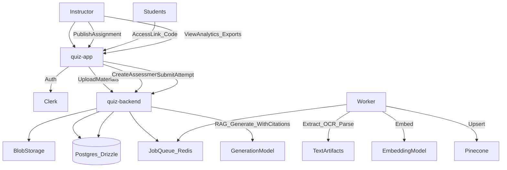

## Guiding decision (anchor)

- **Problem**: The product is currently modeled as an individual creating quizzes for themselves (user → quizzes → results), but the target market thinks in **workspaces (schools/companies)**, **courses**, **cohorts/students**, **assignments**, and **grading/analytics**.
- **Right call**: Reframe the core domain as **Workspace → Courses → Cohorts → Assignments → Attempts/Results**, and treat “AI quiz generation” as a feature inside a broader assessment workflow.
- **Why it matters**: This unlocks team budgets, creates switching cost via course history + rosters + analytics, and aligns with how educators buy and adopt tools.

---

## Current codebase baseline (what you already have)

### Backend

- **Auth**: Clerk middleware in Express (`quiz-backend/src/app.ts`).
- **Core entities**: `users`, `quizzes`, `questions`, `results`, `documents`, `chat_sessions`, `chat_messages` in Drizzle (`quiz-backend/src/config/db/schema.ts`).
- **AI generation**:
  - Quiz creation uses a LangGraph agent (`quiz-backend/src/ai/agent/airaAgent.ts`, `.../Graph.ts`, `.../tools.ts`) and Gemini via LangChain.
  - Quiz tutor/chat uses direct `@google/genai` with prompts built from quiz questions + history (`quiz-backend/src/services/aiservice.ts`).
- **Document ingestion**: Upload during quiz creation; parses PDF, OCRs images, chunks text, embeds with Gemini embeddings, and upserts to Pinecone (`quiz-backend/src/controllers/quiz.controller.ts`, `.../ai/parsedoc/doc.ts`, `.../utils/ocr.ts`, `.../utils/chunk.ts`, `.../ai/pinecone.ts`).
- **Usage/billing scaffolding**: `plans`, `billings`, `usage` tables; usage endpoint; plan seeding (`quiz-backend/src/config/db/schema.ts`, `quiz-backend/src/routes/utility.routes.ts`, `quiz-backend/src/plan.ts`).
- **Real-time**: Socket.IO server handles chat and emits progress updates during quiz creation (`quiz-backend/src/server.ts`, `quiz-backend/src/controllers/quiz.controller.ts`).

### Frontend

- **Next.js app router** with dashboard pages: create quiz, list quizzes, take quiz, view results, chat (`quiz-app/app/dashboard/`\*\*).
- **Clerk-protected dashboard** via middleware (`quiz-app/middleware.ts`).
- **Quiz creation UX**: multipart upload + socket “status” stream (`quiz-app/components/dashboard/createQuizForm.tsx`).
- **Usage UI widget** exists and queries `/api/utility/usage` (`quiz-app/components/dashboard/UsageWidget.tsx`, `quiz-app/hooks/useUtility.tsx`).

---

## 1) Product features to build for educators/trainers (decisions)

### Decision 1: Make “Content Library” the primary workflow (not quiz creation)

- **Problem**: Ingestion is currently quiz-scoped and ephemeral: files are uploaded, processed, vectors upserted, then files deleted; PDFs aren’t persisted to `documents` consistently and `uploadUrl` is mostly empty.
- **Right call**: Create a first-class **Library** experience: upload course materials once, organize them by course/module, index once, and reuse to generate multiple assessments.
- **Why**: This is the time-saver and switching cost. Educators repeatedly reuse the same materials.

### Decision 2: Introduce “Courses + Cohorts + Assignments” as first-class objects

- **Problem**: Current navigation and schema are “my quizzes” and “my results”. No student roster, no assignment distribution, no teacher view of outcomes.
- **Right call**: Add:
  - **Course**: container for materials, quizzes, assignments
  - **Cohort/Group**: a set of students
  - **Assignment**: publishable assessment with settings (due date, attempts, time limit)
  - **Student Attempt**: per-student results + timestamps
- **Why**: This is the mental model for both K-12/higher-ed and corporate training.

### Decision 3: MVP feature set to charge money (minimum viable paid)

- **Problem**: Today you can generate and take quizzes, but a trainer can’t run a real assessment program.
- **Right call**: Paid MVP should include:
  - Content Library (upload/index, organize)
  - Course + Cohort roster (invite links/codes + CSV import later)
  - Assignment publish + share (link/code, due date, attempt policy)
  - Teacher grading dashboard (completion, scores, item analysis)
  - Basic export (CSV)
- **Why**: These map to “I can run my class/training” and justify budget.

### Decision 4: Create switching costs intentionally

- **Problem**: Generated quizzes are easy to recreate elsewhere.
- **Right call**: Switching costs should come from:
  - Library corpus + indexing
  - Course history (assignments, attempts over time)
  - Analytics insights (weak concepts, question quality stats)
  - Collaboration (team roles, shared question bank)
- **Why**: Retention is driven by accumulated structure and insights, not the LLM.

---

## 2) Data model changes (decisions)

### Decision 5: Add Workspace/Organization as the tenant now

- **Problem**: Everything is per-user; billing is per-user (`billings.userId`). Teams/schools need shared billing and shared resources.
- **Right call**: Introduce **workspaces** and make most entities workspace-scoped.
- **Why**: Doing it later forces migration across every table and query.

### Decision 6: Minimum viable schema for teacher + students workflow

- **Problem**: Current `results` are “user took quiz”; there’s no teacher assigning and students completing.
- **Right call**: Add the smallest set of new tables while preserving existing ones:
  - `workspaces` (id, name, createdAt)
  - `workspace_members` (workspaceId, userId, role: owner/admin/instructor/learner)
  - `courses` (workspaceId, title, status)
  - `course_materials` (courseId, documentId, version, indexingStatus)
  - `cohorts` (courseId, name)
  - `cohort_members` (cohortId, memberId)
  - `assignments` (courseId, quizId, cohortId nullable, settings JSON, dueAt, publishedAt)
  - `attempts` (assignmentId, learnerMemberId, startedAt, submittedAt, score, answers JSON)
  - Optionally, `grades` if you want teacher overrides/comments.
- **Why**: This converts you from “creator/user” to “instructor → learners” without rewriting quiz generation.

### Decision 7: Billing model becomes workspace-scoped, entitlement-driven

- **Problem**: Current `plans.monthlyLimit` is a JSON blob and billing lifecycle/provider IDs are missing.
- **Right call**:
  - Move `billings` to reference `workspaceId` (bill-to entity)
  - Add provider fields (customer/subscription IDs) and a webhook event ledger
  - Replace/augment `usage` counters with a **usage ledger** for billable events (assignment created, attempts, AI tokens, ingestion pages).
- **Why**: Educator market expects seat/team billing and admins. Ledgers enable disputes, analytics, and flexible pricing.

---

## 3) Monetization for this market (decisions)

### Decision 8: Pricing structure: educator vs corporate trainer

- **Problem**: One-size pricing doesn’t fit both individual teachers and corporate L&D.
- **Right call**: Two tracks:
  - **Educator/School**: per-instructor seat + included student seats/attempts per month, with discounts for annual + volume.
  - **Corporate/L&D**: per-workspace base + per-seat (instructors) + metered usage for high-volume attempts, plus SSO as add-on.
- **Why**: Schools budget by seats; corporate budgets by team + usage.

### Decision 9: Free tier that drives activation but protects cost

- **Problem**: Unbounded ingestion and AI calls can burn budget; free must still feel useful.
- **Right call**: Free should allow:
  - 1 course
  - 1 cohort
  - limited materials ingestion (e.g., 1–2 PDFs, small page cap)
  - 1 published assignment / month
  - limited attempts
  - watermarked exports or no exports
    Paid unlocks scale and trust features.
- **Why**: The upgrade trigger should be “I’m ready to assign this to my class/training”.

### Decision 10: Upgrade trigger moments (design for the moment)

- **Problem**: A pricing page alone won’t convert educators.
- **Right call**: Trigger upgrade at:
  - publishing a 2nd assignment, or
  - inviting >N students, or
  - exporting results, or
  - ingesting beyond page/material limits, or
  - requesting audit/citations.
- **Why**: Those are natural “I’m using this for real now” moments.

---

## 4) AI features that serve educators (decisions)

### Decision 11: Trustworthiness is the differentiator (citations + controls)

- **Problem**: Current generation returns questions without grounding/citations; chat prompts can be large and non-auditable.
- **Right call**: Make AI output “assessment-ready” via:
  - citations (docId + page/slide + excerpt)
  - difficulty + learning objective tagging
  - rubric/explanations that reference source text
  - “teacher edit mode” with change tracking
- **Why**: Trainers need defensible questions; trust beats novelty.

### Decision 12: Position ingestion as an explicit pipeline with artifacts

- **Problem**: Ingestion is embedded in quiz creation; PDFs aren’t stored in `documents`; `uploadUrl` is unused; indexing can’t be managed.
- **Right call**: Separate workflows:
  - Ingest material → extract text → chunk → embed → index
  - Store artifacts: original blob URL, extracted text by page, chunk metadata
  - Allow reindex/versioning
- **Why**: Educators reuse materials over time; you need controllability and repeatability.

### Decision 13: Cost control for educator features (quotas + caching + async jobs)

- **Problem**: Heavy ingestion and prompts run inline in request path; chat includes full quiz context.
- **Right call**:
  - Queue ingestion and generation jobs
  - Cache embeddings by content hash
  - Use retrieval/summaries for chat instead of including full quiz content
  - Rate-limit by cost units (pages, tokens, websearches)
- **Why**: Team deployments create bursty load (class starts Monday 9am) and you must remain stable.

---

## 5) Go-to-market fit with current stack (keep vs deprioritize)

### Keep (directly supports educator market)

- **Clerk**: strong for fast auth; extend with organizations/workspaces.
- **Pinecone**: valuable if you commit to library-first RAG and citations.
- **Redis**: useful for job queues, socket scaling, caching (not just rate-limits).
- **Websockets**: useful for “processing status” during ingestion and generation.

### Deprioritize (noise vs pivot goal)

- **Agentic websearch as a default**: useful occasionally, but increases cost and reduces trust; keep as an optional Pro toggle with hard caps.
- **Student-facing tutor chat as the flagship**: it’s nice, but your buyer is the instructor; make instructor tools primary.
- **Notion integration**: only keep if it maps to “course materials import”; otherwise postpone until core library works.

---

## Target end-state flow (for the educator demo)

---

## 30-day build sequence to reach a demoable educator product (decisions by week)

### Week 1: Domain + tenancy foundation (thin slice)

- Decide and implement (conceptually): workspace-scoped tenancy and roles.
- Decide initial “educator” vs “learner” role UX: separate dashboards.
- Decide billing entity: workspace is bill-to.

### Week 2: Content library MVP

- Decide the ingestion contract (artifact storage, indexing status, versioning rules).
- Decide supported formats for demo: PDF + image OCR + TXT.
- Decide how citations will be represented (doc/page/excerpt).

### Week 3: Courses + cohorts + assignment distribution

- Decide the minimum assignment lifecycle: draft → published; link/code access.
- Decide student onboarding for demo: invite link + email optional.
- Decide attempt policy: attempts allowed, time limit, due date.

### Week 4: Teacher analytics + monetization demo

- Decide the 3 analytics views that sell: completion rate, score distribution, question difficulty/distractor analysis.
- Decide export/print surfaces (CSV export is enough for demo).
- Decide upgrade trigger and paywall boundaries; integrate checkout later, but ensure entitlements can be enforced.

---

## Key codebase constraints to account for (architecture decisions)

- **Auth consistency**: some endpoints accept `userId` in query/body; decision is to derive identity only from Clerk (`quiz-backend/src/routes/chat.routes.ts`).
- **Usage enforcement is bypassable today**: `/quizzes/check` exists but quiz creation doesn’t enforce it (`quiz-backend/src/routes/quiz.routes.ts`; `quiz-app/components/dashboard/createQuizForm.tsx`). Decision: enforce entitlements at the creation endpoint.
- **Ingestion persistence is incomplete**: PDF path doesn’t reliably persist `documents` or blob URLs; decision: make `documents.uploadUrl` and ingestion artifacts real.
- **Sockets aren’t horizontally scalable**: in-memory socket maps; decision: use Redis adapter or accept single instance for demo.
